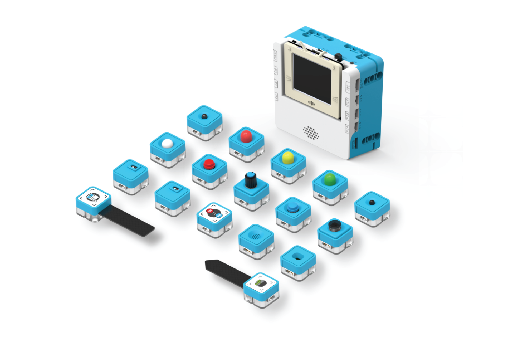

# sugarbox

Extension for Kittenbot Sugarbox




## Feature

This extension is designed to programme and drive the moudule series Sugar for micro:bit, You can [get Sugar From KittenBot](https://www.kittenbot.cc/collections/frontpage/products/micro-bit-sugar-series-creator-programming-educational-kit)


1. The first series of the Sugar electronic module system set consists of modules with various functions. Every module is fully covered by environmentally-friendly PC + ABS material and with good quality. 

2. It includes electronic modules that are often used in basic STEM education: digital input, digital output, analog input, analog output, etc.

3. The design of the module's ports has adopted the poka-yoke style, which solves the problem of students inserting the cables reversely in class and makes the project creation process much more efficient.

4. There are stickers on every module indicating the type of the module and the interface, which helps you distinguish each module easily.


## Basic usage

* Usage of digital input sensor

```blocks

    basic.forever(function () {
        if (Sugar.PIR(DigitalPin.P1)) {
            basic.showIcon(IconNames.Heart)
            basic.pause(2000)
            basic.clearScreen()
        }
    }) 

```

---

* Usage of digital output module

```blocks

    let light = 0
    input.onButtonPressed(Button.A, function () {
        Sugar.ledOnoff(DigitalPin.P1, Sugar.LEDSta.Off)
    })
    input.onButtonPressed(Button.AB, function () {
        light = 0
        for (let index = 0; index < 1023; index++) {
            Sugar.ledLuminent(AnalogPin.P0, 0)
            light += 1
        }
        for (let index = 0; index < 1023; index++) {
            Sugar.ledLuminent(AnalogPin.P0, 0)
            light += -1
        }
    })
    input.onButtonPressed(Button.B, function () {
        Sugar.ledOnoff(DigitalPin.P1, Sugar.LEDSta.On)
    })

```

---

* Usage of Analog input module

```blocks

    serial.redirectToUSB()
    basic.forever(function () {
        serial.writeValue("flame", Sugar.FlameAna(AnalogPin.P0))
        serial.writeValue("Light", Sugar.Light(AnalogPin.P0))
        serial.writeValue("Angle", Sugar.Angle(AnalogPin.P0))
        basic.pause(1000)
    })

```

---

* Usage of Analog i2c module

```blocks

    input.onButtonPressed(Button.A, function () {
        basic.showNumber(Sugar.TOFDistance())
    })
    input.onButtonPressed(Button.B, function () {
        basic.showNumber(Sugar.ENV(Sugar.EnvType.Temperature))
        basic.pause(500)
        basic.showNumber(Sugar.ENV(Sugar.EnvType.Humidity))
    })
    basic.forever(function () {
        led.unplot(0, 0)
        led.plot(Math.map(Sugar.joyValue(Sugar.DirType.X), -255, 255, 0, 4), Math.map(Sugar.joyValue(Sugar.DirType.Y), -255, 255, 0, 4))
        if (Sugar.joyState(Sugar.JoystickDir.pressed)) {
            basic.showIcon(IconNames.Happy)
            basic.pause(1000)
        }
    })

```

---

* Usage of Sugarbox Extension Board —— DC motor and servo

```blocks

    input.onButtonPressed(Button.A, function () {
        SugarBox.motorSpd(SugarBox.MPort.M1A, 255)
        SugarBox.motorSpd(SugarBox.MPort.M1B, 255)
        basic.pause(1000)
        SugarBox.motorStopAll()
    })
    input.onButtonPressed(Button.B, function () {
        SugarBox.servoPulse(SugarBox.SPort.S1, 500)
        basic.pause(1000)
        SugarBox.servoPulse(SugarBox.SPort.S1, 1500)
        basic.pause(1000)
        SugarBox.servoPulse(SugarBox.SPort.S1, 2500)
        basic.pause(1000)
    })
    SugarBox.waitready()

```

---

* Usage of Sugarbox Extension Board —— Encoder Motor

```blocks

    input.onButtonPressed(Button.A, function () {
        SugarBox.eMotorSetRpm(SugarBox.EPort.EM1, 240)
        basic.pause(1000)
        basic.showNumber(SugarBox.eMotorGetRpm(SugarBox.EPort.EM1))
        SugarBox.motorStopAll()
    })
    SugarBox.waitready()
    SugarBox.encMotorInit(SugarBox.EPort.EM1)


```


## License

MIT


## Supported targets

* for PXT/microbit
(The metadata above is needed for package search.)

```package
sugarbox=github:Kittenbot/pxt-sugar
```
